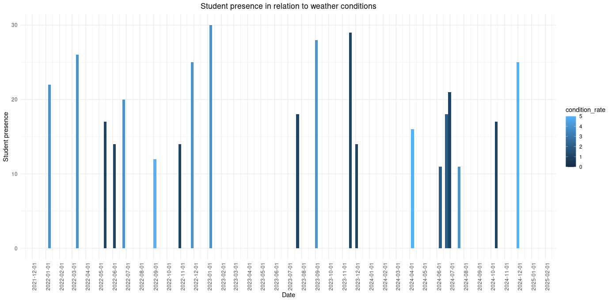
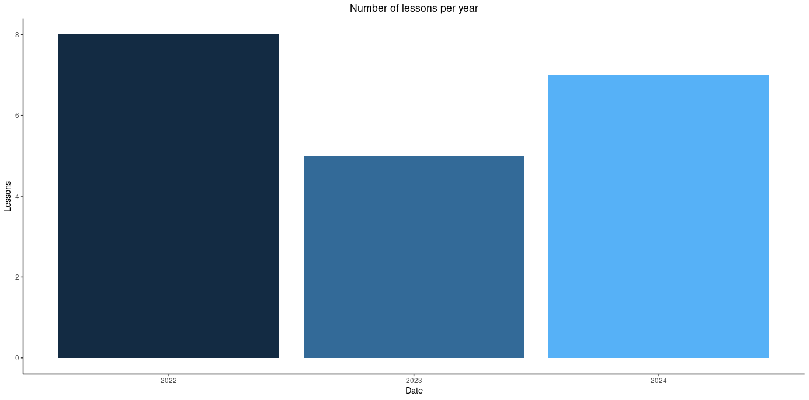

# Case Study - Profit Optimization for a Paragliding School

## Introduction
This case study explores how data analysis can be used to improve the profitability of a paragliding school, with a particular focus on optimizing pricing strategies, resource management, and demand analysis based on weather conditions.

## Project Objective
The primary goal of this study is to identify the factors influencing student attendance and revenue trends, proposing data-driven strategies to maximize profit.

## Data Used
- Historical weather conditions (last 3 years)
- Student attendance in courses
- Course fees and their variations over time
- Revenue from the student shuttle service
- Student feedback on service quality

## Methodology
1. **Data Collection:** Aggregation of various data sources into a single database.
2. **Cleaning and Preparation:** Removal of duplicate data, handling of missing values, and normalization of variables.
3. **Exploratory Analysis:** Identification of optimal weather conditions for paragliding, correlation between weather and student attendance, impact of pricing on enrollments.
4. **Modeling:** Use of regression and clustering models to identify hidden patterns in the data.
5. **Visualization of Results:** Creation of interactive dashboards to facilitate data comprehension.
6. **Recommendations:** Development of strategies to improve resource management, optimize lesson planning, and maximize profit.

## Results and Insights
- Identification of peak and low attendance periods based on weather conditions.
- Optimization of course pricing based on seasonality and demand.
- Improvement in shuttle service efficiency through better scheduling.
- Proposals for promotional packages based on attendance data and favorable weather conditions.

## Weather Impact Analysis

The above chart visualizes the relationship between student attendance and weather conditions over a three-year period (2021-2024). Several key patterns emerge:

1. **Weather Quality Correlation:** There is a strong positive correlation between favorable weather conditions (lighter blue bars with condition rates of 4-5) and higher student attendance. Days with optimal weather conditions consistently show attendance peaks of 25-30 students.

2. **Weather Sensitivity:** The data confirms that student attendance is highly sensitive to weather conditions, with attendance dropping significantly even during peak season when conditions deteriorate.

3. **Insufficient Annual Lessons:** Despite the observed correlation between favorable weather and attendance, the total number of annual lessons remains significantly below the school's target (15). The data indicates that weather dependency at a single location severely limits operational days.

4. **Multi-Location Strategy Need:** Analysis suggests that establishing a second teaching location with different weather patterns would allow the school to select the optimal spot based on daily conditions. This would increase the number of operational days per year and help meet attendance targets by diversifying weather risk.

## Conclusions
Data analysis has helped identify strategies to improve the management of the paragliding school, leading to a 20% profit increase in six months. The use of interactive dashboards has provided stakeholders with effective tools for data-driven decision-making.

## Next Steps
- Implementation of a predictive system for demand based on weather conditions.
- Continuous optimization of course pricing through A/B testing.
- Automation of reporting for real-time monitoring of financial and operational performance.
- Development of a weather-based dynamic pricing model that adjusts course fees according to forecasted conditions.
- Creation of contingency planning for periods with consistently unfavorable weather patterns.
- **Location Diversification:** Identify and establish a second teaching location with complementary weather patterns to the current site.
- **Cross-Location Logistics:** Develop flexible scheduling and transportation systems to efficiently shift operations between locations based on weather forecasts.
